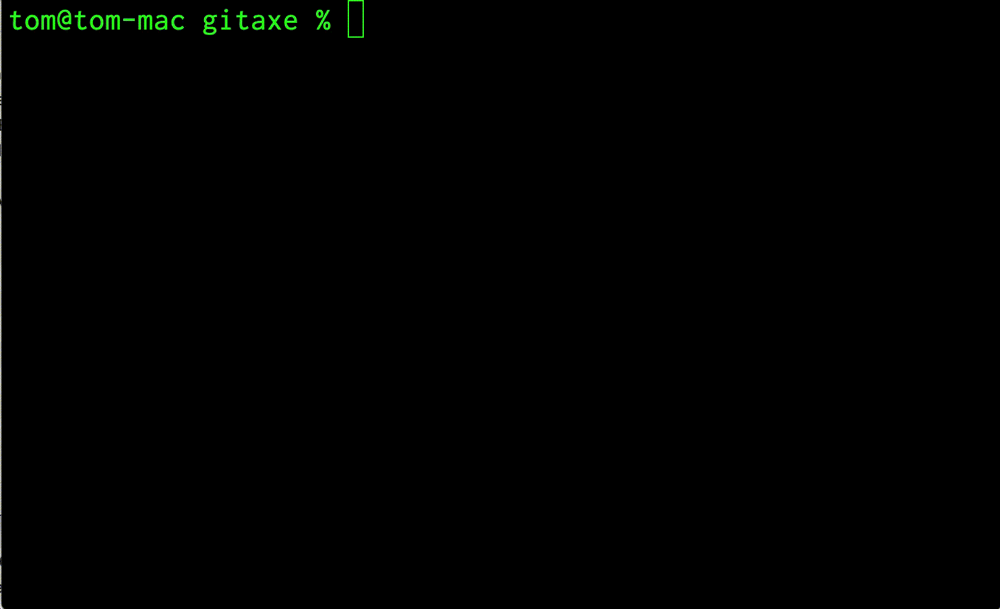

# gitaxe

This is a command line tool to make it easy to work with local branches in a git repository.

**Use with caution, if you delete a local branch that hasn't been pushed to remote there's no retrieving that work.**

## Installation

`npm install -g gitaxe`

## Usage

`gitaxe`

You will then be presented with a list of options depending the status of your local git repository.

### Exit

This will just print the status of your local git repository and exit.

### Change Branch

This will list your local branches allowing you to pick a branch to change to. Your current branch will be first in the list.

### Delete Branches

- You will then be presented with a list of the local branches of your git repository, check the ones you want to delete using the arrow keys and space bar, press enter when done.
- If don't check any branches `gitaxe` will just exit.
- You will then need to confirm that you do indeed want to delete the selected branches.
- If you say **yes** `gitaxe` will call `git branch -D <branch>` on each of the branches you selected.

### Delete Untracked Files

- You will be asked to confirm that you want to delete the untracked files.

### Commit All

- All changes will be staged for commit
- You will be prompted for a commit message
- If you give a message the changes will be commited with the message

